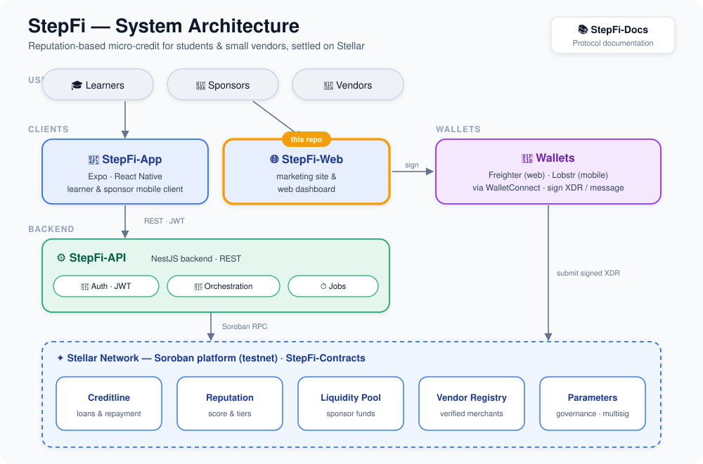

# Stellar Lendify - Decentralized Buy Now Pay Later on Stellar

[](https://react.dev/)
[](https://www.typescriptlang.org/)
[](https://soroban.stellar.org/)
[](LICENSE)
[](https://github.com/Lendify-Onchain-Org/Stellar-Lendify/actions/workflows/ci.yml)

Stellar Lendify is an open-source Buy Now Pay Later (BNPL) protocol on the Stellar blockchain. This repository houses the desktop-facing web application built for the sponsors, vendors, and mentors who keep the lending pool running. It provides a comprehensive interface for funding the protocol, listing products, and vouching for learners, securely interacting with Soroban smart contracts on the Stellar network.


---

## Table of Contents

- [Project Overview](#-project-overview)
- [Setup Instructions](#-setup-instructions)
  - [Prerequisites](#-prerequisites)
  - [Quick Start](#-quick-start)
  - [Environment Setup](#-environment-setup)
  - [Running Tests](#-running-tests)
- [Features](#-features)
- [Ecosystem Architecture](#-ecosystem-architecture)
- [Deployed Contracts](#-deployed-contracts)
- [Live Deployments](#-live-deployments)
- [CI/CD Pipeline](#-cicd-pipeline)
- [Helpful Links](#-helpful-links)
- [Contribution Guidelines](#-contribution-guidelines)
- [License](#-license)
- [Support](#-support)

---

## Project Overview

While learners use a separate mobile app to apply for credit and repay installments, this web application is designed for the liquidity providers, merchants, and reputation validators of the Stellar Lendify ecosystem.

### Key Benefits

| Benefit | Description |
|---------|-------------|
| **Trustless Yield** | Sponsors earn algorithmic yield from real-world lending activities |
| **Upfront Payments** | Vendors get paid immediately while learners repay in installments |
| **On-Chain Reputation** | Mentors can cryptographically vouch for trusted developers |
| **Complete Transparency**| All loans, pool stats, and credit lines are verifiable on Stellar |
| **Open Ecosystem** | Modular protocol architecture with programmatic API access |

### Target Users

- **Sponsors**: Individuals, companies, and DAOs that deposit USDC into the liquidity pool to fund loans and earn yield.
- **Vendors**: Bootcamps, electronics retailers, and dev tool providers that list products for learners to finance.
- **Mentors**: Senior developers who vouch for junior developers to boost their on-chain reputation and credit limits.

---

## Setup Instructions

### Prerequisites

Before you begin, ensure you have the following installed:

- **Node.js 18+** - [Install Node.js](https://nodejs.org/)
- **npm** or **yarn** - Package manager
- **Git** - For version control

### Quick Start

Get up and running in under 2 minutes:

```bash
# Clone the repository
git clone https://github.com/Lendify-Onchain-Org/Stellar-Lendify.git
cd Stellar-Lendify

# Install dependencies
npm install

# Start the development server
npm run dev
```

### Environment Setup

The application runs against the live testnet API by default. No local backend setup is required to start contributing. 

If you need to connect to a local backend, create a `.env` file or set the variable inline:

```bash
VITE_API_BASE_URL=http://localhost:3000/api/v1 npm run dev
```

### Running Tests

Ensure everything is working correctly with our test suites:

```bash
# Run unit and component tests once
npm test

# Run tests with a coverage report
npm run test:coverage

# Build and run accessibility checks
npm run test:a11y

# Lint the codebase
npm run lint
```

---

## Features

### 🏦 For Sponsors
- **Live Pool Dashboard:** View total deposits, available/locked liquidity, and current APY.
- **Deposit & Withdraw:** Deposit USDC for pool shares and withdraw shares plus earned yield at any time.
- **Portfolio Tracking:** Track position value, earned yield, and view which active loans your capital is backing.

### 🏪 For Vendors
- **Business Onboarding:** Register your business and get approved into the protocol.
- **Catalog Management:** List products and services available for financing.
- **Analytics & Tracking:** Track loans tied to your catalog, view payment history, and monitor total volume received.

### 🤝 For Mentors
- **Vouching System:** Review vouch requests from learners and view their public profile/reputation history.
- **Cryptographic Signatures:** Submit vouches securely using a wallet signature.
- **Vouch Management:** Track active vouches, their expiry, and revoke vouches if necessary.

---

## Ecosystem Architecture

<div align="center">
  
</div>

Stellar Lendify is split across multiple repositories that together form one unified protocol. All repositories talk to the same live API and Soroban contracts.

| Repository | Purpose | Tech Stack |
|--------|---------|--------|
| **[Stellar-Lendify](https://github.com/Lendify-Onchain-Org/Stellar-Lendify)** | **This repo. Web app for sponsors, vendors, and mentors.** | **Vite, React, TypeScript** |
| [Stellar-Lendify-Contracts](https://github.com/Lendify-Onchain-Org/Stellar-Lendify-Contracts) | On-chain logic: credit line, reputation, liquidity pool, vendor registry | Rust, Soroban |
| [Stellar-Lendify-API](https://github.com/Lendify-Onchain-Org/Stellar-Lendify-API) | Off-chain orchestration: auth, loan building, background jobs | NestJS, Fastify, Supabase |
| [Stellar-Lendify-App](https://github.com/Lendify-Onchain-Org/Stellar-Lendify-App) | Mobile app for learners: apply for credit, repay installments | React Native, Expo |
| [Stellar-Lendify-Docs](https://github.com/Lendify-Onchain-Org/Stellar-Lendify-Docs) | Full protocol documentation | docs.page |

---

## Deployed Contracts

The protocol operates through five core Soroban smart contracts deployed on the **Stellar Testnet**.

| Contract | Contract ID |
|------------|------------|
| Creditline | `CAQDHYG3TALPNXG466SZUMJEPOI7VYV732LPFF3GHE4ASPBCNMIQBS3X` |
| Reputation | `CC3BO57ZRJGA63QJBIBSOMI25Z3X2I5CYTARYRAUXUAILX6L3OWBL5SB` |
| Liquidity Pool | `CACKE7ML2BTOAGQTAAW5NEARHCFX4PXXKGEO6GMU6NHFBVYQFZRJS2BT` |
| Vendor Registry | `CCZ6T6NYCDNI26VGTPXKKWQDR7JCIZZ24LCEG4MMYHZJAG6BPWIVAU2L` |
| Parameters | `CCAE72SKYX55C5L56DBEFIMFVXRUIJY6JYLBREHEWRFNOW7AX5NBIJ5B` |

> *Verified via SHA256 hash comparison. Full release with WASM artifacts available [here](https://github.com/Lendify-Onchain-Org/Stellar-Lendify-Contracts/releases/tag/v1.0.0).*

---

## Live Deployments

| Resource | Link |
|-----------|------|
| Landing Page | https://stellar-lendify.vercel.app |
| Interactive Demo | https://stellar-lendify.vercel.app/demo |
| Backend API | https://stellar-lendify-api.onrender.com/api/v1 |
| API Docs (Swagger) | https://stellar-lendify-api.onrender.com/api/v1/docs |
| API Playground | https://stellar-lendify.vercel.app/playground |
| Full Documentation | https://docs.page/Lendify-Onchain-Org/Stellar-Lendify-Docs |

---

## CI/CD Pipeline

Every push and Pull Request triggers our GitHub Actions pipeline (`.github/workflows/ci.yml`), which acts as a required gate before merging to `main`. 

| Stage | Command | Purpose |
|----------|---------|---------|
| **Lint** | `npm run lint` | Enforce code style and catch issues |
| **Type Check** | `tsc -b` | Ensure TypeScript integrity |
| **Test** | `npm test` | Run Vitest suite |
| **Build** | `npm run build` | Produce production build |

The landing page component is served from **Vercel** via `vercel.json`.

---

## Helpful Links

### Documentation
- [API Documentation (Swagger)](https://stellar-lendify-api.onrender.com/api/v1/docs)
- [Full Protocol Docs](https://docs.page/Lendify-Onchain-Org/Stellar-Lendify-Docs)
- [Architecture Details](context/architecture-context.md)
- [Code Standards](context/code-standards.md)

### Repository Resources
- [Progress Tracker](context/progress-tracker.md)
- [Verification Guide](VERIFICATION.md)

---

## Contribution Guidelines

Stellar Lendify is open source and welcomes contributors of all experience levels!

### Getting Started

1. **Read** the files in the `context/` folder before writing any code.
2. **Browse** open issues labeled by difficulty (`good first issue`, `medium`, `hard`, `core`).
3. **Fork** the repository and clone it locally.
4. **Create** a feature branch: `git checkout -b feature/your-feature-name`
5. **Build** your feature and ensure all tests/linting pass.
6. **Open a PR** referencing the issue number.

### Earn Rewards for Contributions

Stellar Lendify is live on **Grantfox**, an open-source collaboration hub in the Stellar ecosystem. Every merged PR earns transparent Stellar rewards. No application gate—just build and ship.

- **Create a Grantfox Account:** [Join Here](https://contribute.grantfox.xyz/join?ref=EmeditWeb)
- **Browse Bountied Issues:** [Lendify-Onchain-Org on Grantfox](https://contribute.grantfox.xyz/org/Lendify-Onchain-Org)

---

## License

This project is licensed under the MIT License - see the [LICENSE](./LICENSE) file for details.

---

## Support

- **Issues**: [GitHub Issues](https://github.com/Lendify-Onchain-Org/Stellar-Lendify/issues)

---

<p align="center">
  Built with 💙 on Stellar
</p>
